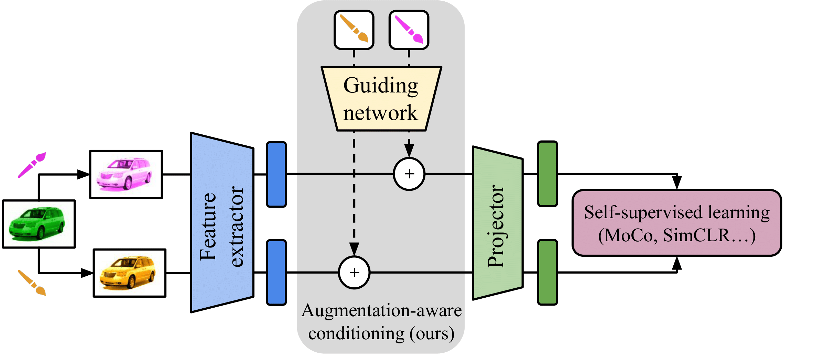

# Augmentation-aware Self-Supervised-Learning with Guided Projector

Under review.


**TL;DR:**  We condition the projector of self-supervised models with augmentation information and demonstrate that this improves their performance during transfer learning.

<p align="center">

</p>


## Overview
Self-supervised learning (SSL) is a powerful technique for learning robust representations from unlabeled data. 
By learning to remain invariant to applied data augmentations, methods such as SimCLR and MoCo are able to reach quality on par with supervised approaches. 
However, this invariance may be harmful to solving some downstream tasks which depend on traits affected by augmentations used during pretraining, such as color. 
In this paper, we propose to foster sensitivity to such characteristics in the representation space by modifying the projector network, a common component of self-supervised architectures. 
Specifically, we supplement the projector with information about augmentations applied to images. 
In order for the projector to take advantage of this auxiliary guidance when solving the SSL task, the feature extractor learns to preserve the augmentation information in its representations. 
Our approach, coined **C**onditional **A**ugmentation-aware **S**elf-**s**upervised **Le**arning (**CASSLE**), is directly applicable to typical joint-embedding SSL methods regardless of their objective functions. 
Moreover, it does not require major changes in the network architecture or prior knowledge of downstream tasks. 
In addition to an analysis of sensitivity towards different data augmentations, we conduct a series of experiments, which show that CASSLE improves over various SSL methods, reaching state-of-the-art performance in multiple downstream tasks.

## Checkpoints

We provide checkpoints for models pretrained with and without CASSLE in [this Google Drive folder](https://drive.google.com/drive/folders/1_1FFFYzT0-H-fUTm83-oB4Y-Pd6Kp511?usp=sharing).

## Dependencies

```bash
conda create -n CASSLE python=3.8 pytorch=1.7.1 torchvision=0.8.2 cudatoolkit=10.1 ignite -c pytorch
conda activate AugSelf
pip install scipy tensorboard kornia==0.4.1 sklearn wandb
```


## Pretraining

We provide a command for pretraining MoCo-v2 + CASSLE. To train the Baseline model, replace the `--aug-inj-type` option to `proj-none`. To train [AugSelf](https://arxiv.org/abs/2111.09613), use `--aug-inj-type proj-none --ss-crop 0.5 --ss-color 0.5`. 
For using other frameworks like SimCLR, use the `--framework` option.


```bash
python pretrain_cond.py  \
  --logdir $LOGDIR \
  --framework moco --dataset imagenet100 --datadir $IMGENET_100_FOLDER \
  --model resnet50 --batch-size 256 --max-epochs 500 \
  --aug-treatment mlp --aug-nn-depth 6 --aug-nn-width 64 --aug-inj-type proj-cat \
  --aug-cond crop color color_diff blur grayscale \
  --base-lr 0.03 --wd 1e-4 --ckpt-freq 50 --eval-freq 50 --num-workers 16 --seed 1 --distributed
```

## Evaluation

Our main evaluation setups are linear evaluation on fine-grained classification datasets (Table 1).
### linear evaluation

```bash
CUDA_VISIBLE_DEVICES=0 python transfer_linear_eval.py \
    --pretrain-data imagenet100 \
    --ckpt CKPT \
    --model resnet50 \
    --dataset cifar10 \
    --datadir DATADIR \
    --metric top1
```

## Acknowledgements

This codebase is built upon [this code](https://github.com/hankook/AugSelf) for the excellent 
**[Improving Transferability of Representations via Augmentation-Aware Self-Supervision](https://arxiv.org/abs/2111.09613)** 
by Hankook Lee, Kibok Lee, Kimin Lee, Honglak Lee, and Jinwoo Shin. 
We are very thankful to the authors for providing an excellent-quality reproducible code to the community and guiding us on running it.
